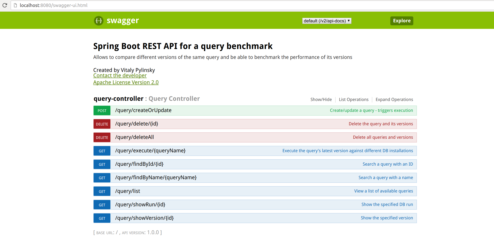
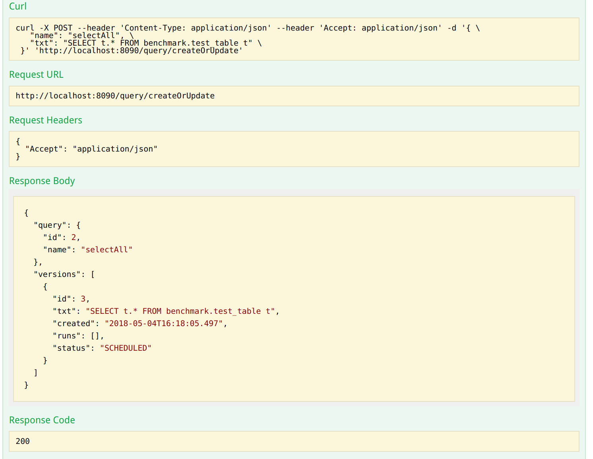
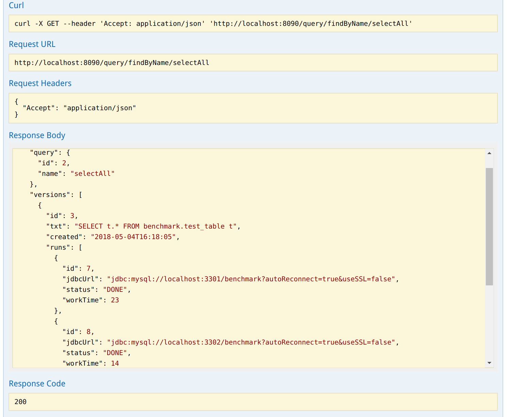
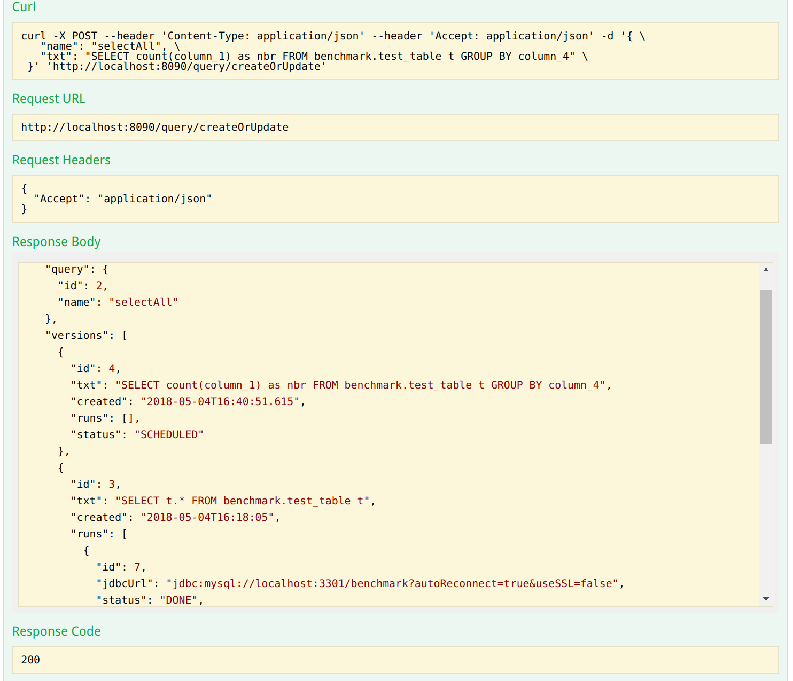

# benchmark

The service represents Async-like calls, i.e. when you run the query you don't need to wait when it's done. It allows to avoid connection timeouts in case of long-running queries.

The service is like an CI tool (e.g. Jenkins), you trigger evaluation of the query and then can check its status. 
You create a new query, or edit existing one, or execute the latest version of a query - it triggers parallel runs on DB installations.
The DB installations are managed by application.properties file. You can specify several installations.

There is a separate SingleThread pool executor per DB installation. It allows to make sure that only one run is happening on the DB 
at a particular point of time. Since there is a separate queue to each DB, if there is a DB that works faster than others, 
then a query can start its execution on the DB once the other query on that DB is done (i.e. while runs of the first query on other DBs are not ready).

Also there is a ReentrantLock that only blocks sending of a query's version and its runs to SingleThread executors (i.e. it blocks only filling in of the queues), 
right after that the application releases the lock and other query can acquire the lock and put its runs to the executors' queues. 
The lock makes sure that queries will be placed to the queues correctly one by one, keeping right order in each executor i.e. runs of one query go after another query's runs. 

## How to run the Server

To run server you need maven to be installed. Also project requires Java 1.8.
You can specify multiple Data Sources in application.properties file.
Under the project’s folder you can run command:

`mvn spring-boot:run`

It will require DBs to be up and running. Please find docker/docker-compose.yml that can be used to bring up MySql servers,
create testing DBs and insert some data (go to docker/mysql folder and run import.sh script).

Tomcat will be up and run on port 8080. Then you’ll be able to call web services, for example:

`curl -X GET 'http://localhost:8080/actuator/health'`

`curl -X GET 'http://localhost:8080/query/list'`

`curl -X POST --header 'Content-Type: application/json' -d '{"name": "selectAll", "txt": "SELECT t.* FROM benchmark.test_table t"}' 'http://localhost:8080/query/createOrUpdate'`
 
`curl -X GET 'http://localhost:8080/query/execute/selectAll'`

The REST services documentation is prepared by swagger and is available on
http://localhost:8080/swagger-ui.html

It provides convenient REST client to test the API. Please see below examples of the API usage.

## How to run tests

There are few integrations tests in `src/test/**/BenchmarkServiceIntegrationTests`

To run them you can use command:

`mvn test` 

Tests will be running on H2 in-memory DBs and don't require application to be up.

Also you can launch tests in your IDE.

## Examples

List of available methods:

Create a new Query:

Find by Query name:

Update the Query:

